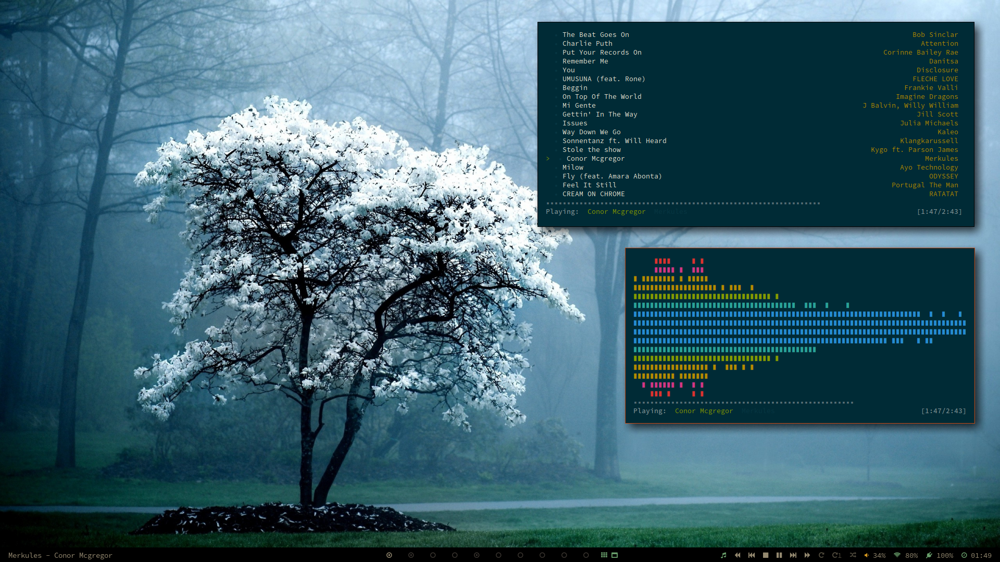

Fonts: Source Code Pro

##Setup

- archlinux
- bspwm
- polybar
- compton
- dunst

##Apps

- firefox-nightly
- chromium (cVim)
- urxvt
  - ranger
  - ncmpcpp
- emacs (spacemacs)
- zathura
- inkscape
- gimp
- dmenu
- ...

##Links

- [Website](https://jonathanconde.com)
- [Twitter](https://twitter.com/JC0nde)
